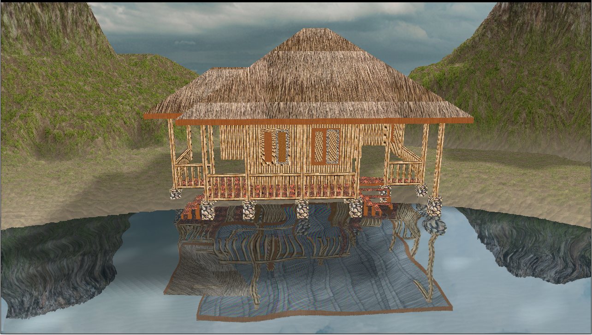
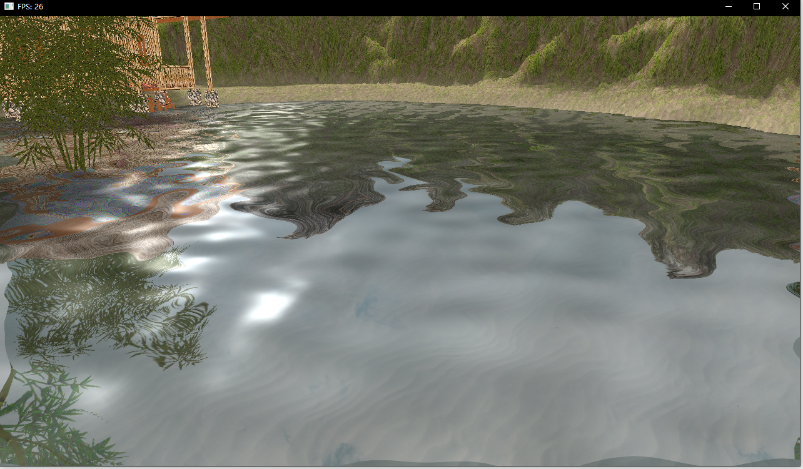
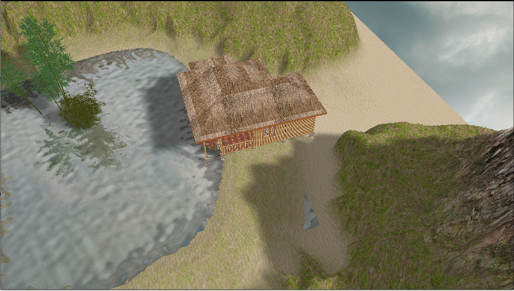

计算机图形学第二组期末项目

zl
zjk
frc

## 项目介绍以及实现结果

我们的项目是一个场景漫游——湖光山色，具体为一个第一视角的场景，角色可以用鼠标控制视角，键盘控制移动，在场景中四处漫游。场景包括山脉，湖泊，树木，并且有较为常见的实时天气效果。

项目效果：

## 开发环境以及使用到的第三方库

OpenGL4.3：glfw3.3 + glad4.3

stb_image

Assimp

## 实现功能列表

下面是功能列表，详细分析和原理介绍按分工在个人报告中展开。

### Basic

* 光照模型: Blinn-Phong

* 纹理贴图

* 模型导入: Assimp

### Bonus

* 天空盒

* 模型导入

* 地形

* 水面

* 阴影

* 粒子系统——雪

## 小组成员分工

|姓名|分工|
|---|---|
|zl|天空盒，光照模型|
|zjk|地形，粒子系统|
|frc|水面，阴影，优化|
