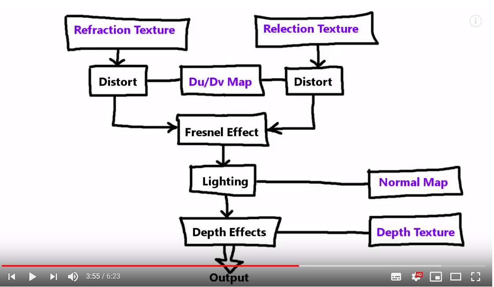
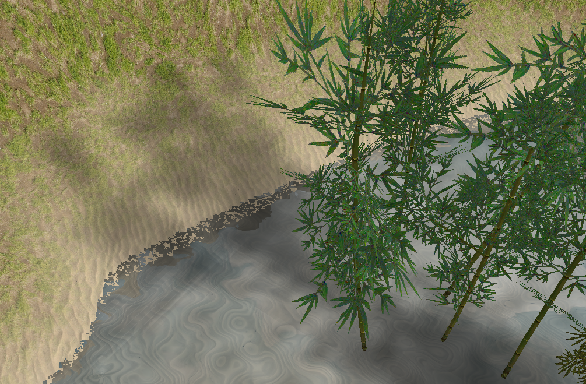
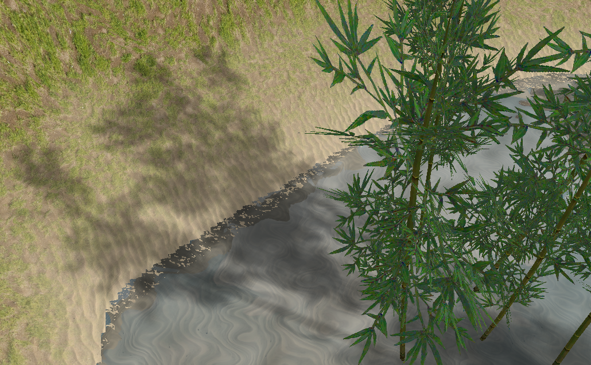
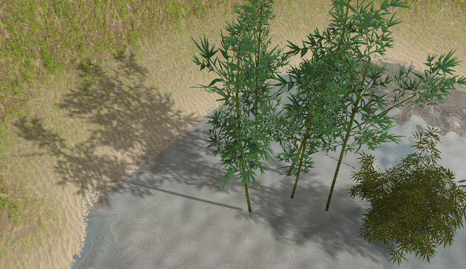

## 实现功能介绍

### 水面

水面参考了[这个采用dudv map的水面教程](https://www.youtube.com/playlist?list=PLRIWtICgwaX23jiqVByUs0bqhnalNTNZh)，这个教程中没有采用模拟水面顶点运动的方法，比如洋流波动的方程，而是用dudv map和normal map来制造动态和波动的效果，生成思路如下：

首先采用和地形一样的方法生成三角网格平面。

由于水面存在反射和折射，因此需先绘制一遍场景，得到反射和折射材质，我们采用的是2D材质，没有用environment mapping。反射材质就是将相机根据水面翻转后的绘制结果，折射材质不改变相机位置，一开始会担心这样是不是会让效果不真实，后来发现水面开始波动后基本看不出来折射的偏移是否正确。

有了两个材质，就可以绘制水面了，根据时间添加dudv map，并综合反射和折射效果，综合的依据是Fresnel定律，即远处水面反射更多，近处折射更多，这里使用了[Schlick近似公式](https://zhuanlan.zhihu.com/p/31534769)。

最后再为水面添加反射的光照，我们的场景中使用了方向光，但方向光在水面的反射效果不好，因此为水面添加一个点光源，以呈现“波光粼粼”的效果。最后的水面效果如下：

### 阴影

阴影采用Shadow mapping方法生成，场景中是静止的方向光，绘制深度图时采用正交投影。

我们为水面、地形的shader都加入绘制阴影的代码，就会呈现水面上也有阴影的效果：

## 后续优化

### CSM

项目的场景很大，而光源又距场景中心比较远，这就导致了阴影的细节很粗糙，比如竹子的阴影完全糊成一片：

可以通过增大shadow map的分辨率来增强阴影的细节，下面就是将shadow map的长和宽都增大三倍后的效果：

虽然这样可以清楚区分树叶的阴影了，但太大的shadow map会带来更大的开销，一个比较好的优化方法是采用CSM：cascade shadow mapping。

阴影细节的根本原因是shadow map精度不足，CSM通过将场景分为远近不同的区域，为每个区域单独配置shadow map以达到离相机近的阴影精度更到，远处不需要高精度的阴影细节就较低。这里的CSM实现基本和我在作业7里实现的CSM一样，[作业链接](https://github.com/Sefaice/Computer-Graphics-Homework/tree/master/hw7)，三个cascade，fit to frustum的投影剪裁，链接里有详细的原理和实现步骤。

最终实现了CSM后，用较低分辨率的shadow map也能达到比较好的阴影效果：

但CSM也有一些问题：cascade间的过渡在加了插值之后仍然太突兀，注意观察还是很明显；另外peter panning用面剔除也无法解决，模型的阴影有一些偏移。

### 地形及模型光照

模型在加载时带有法向量，因此可以直接读取法向量，为模型加入光照模型。

但地形的法向量需要在生成网格时计算，需要在tagent space计算法向量，并且与邻接法向量求平均，[代码](https://github.com/Sefaice/Computer-Graphics-Homework/blob/master/final/src/models/terrain.cpp#L32-L51)，不过这些只是计算比较麻烦，最后还是可以得到地形顶点的法向量。

但是在为地形加入光照模型后，在有些地方由于地形网格的精度并不高，会出现明显的“台阶”，这种规则化的地方在加入光照后十分明显，因此我们最后没有为地形使用光照。若想改善地形精度，就需要不再用灰度图生成地形，而使用随机函数计算每个顶点的位置。

### 优化帧率

项目运行的帧率大约为20fps（在笔记本上，Nvidia 965M），这个帧率不好，我们尝试优化它。

首先review一下每一帧渲染都绘制了什么：

* 绘制反射材质和折射材质。其中每个材质绘制时都要将地形、天空盒、模型渲染一遍，因此这一步骤中场景中大部分物体被绘制了两遍。
* 绘制CSM的shadow map。对于每个cascade（这里为3），计算对应的光源投影矩阵，绘制地形、模型，因此地形和模型在这里被绘制了三遍。
* 绘制场景。这里绘制一遍水面、地形、模型、天空盒。

由此可见，在绘制水面要用的反射折射材质和阴影材质时，场景中的大部分物体进行了多次绘制，这也就是导致帧率低的原因。

#### deferred shading

优化帧率的第一个尝试是采用deferred shading。

不过在实现之前，就觉得可能没啥用，因为deferred shading优化的都是fragment shader中多余的工作，主要集中在lighting，因此对场景中光源很多的情况有比较好的效果，而我们的项目中只有一个光源，且并不是每个物体都需要计算lighting，比如地形的fragment shader中只有纹理读取和阴影计算，没有lighting。

在实现过程中还发现，场景中地形并没有用到光照模型，而model需要用到，这导致采用deferred shading时最后这两个物体不能绘制到一个texture中，而在一个texture中用变量控制使用光照模型又不优雅，因此采用不同光照模型的物体在实现deferred shading时不能使用相同的shader，最终对每个物体都重新创建了shader。  

实现延迟渲染后，最终帧率的确没有提升，仍然在20左右。

#### 倒影/阴影绘制简化

其实从前面的分析中就能看出，帧率问题主要出在绘制水面反射折射材质和阴影材质中。

因此我们从场景中去掉房子——帧率变成了30fps，因此房子这个模型有很大问题。

若在绘制水面材质时完全不绘制模型，不论采用forward shading还是deferred shading，帧率都是60fps，**所以多次模型绘制就是低帧率的原因，优化帧率就要从模型入手**。

因此可以通过在前几次绘制模型时绘制更少的顶点，这需要找到简化的模型或加载一个更少顶点的模型副本，最终我们没有做这些关于模型的操作。其实在shadow map绘制时，采用的shader已经是最简化的，没有光照计算，只有顶点位置的计算。

最后版本的项目中，阴影采用CSM，模型没有房子，采用deferred shading：帧率为30fps。

