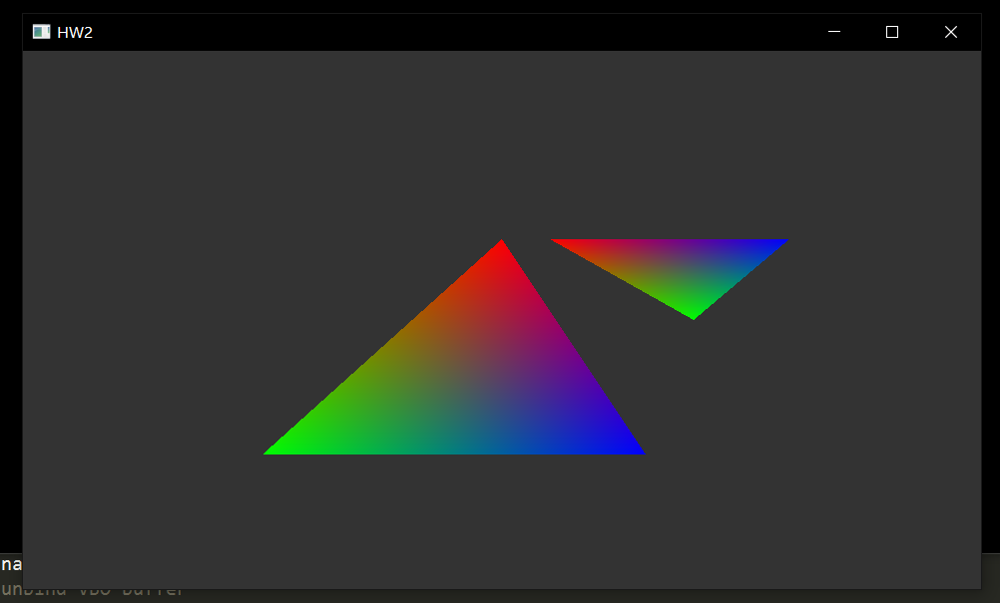
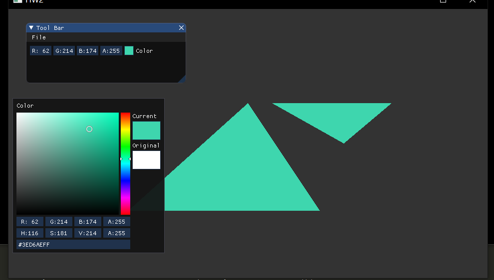
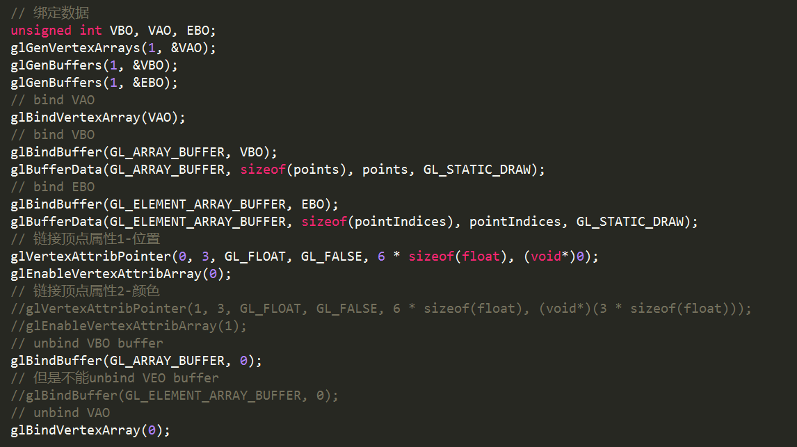
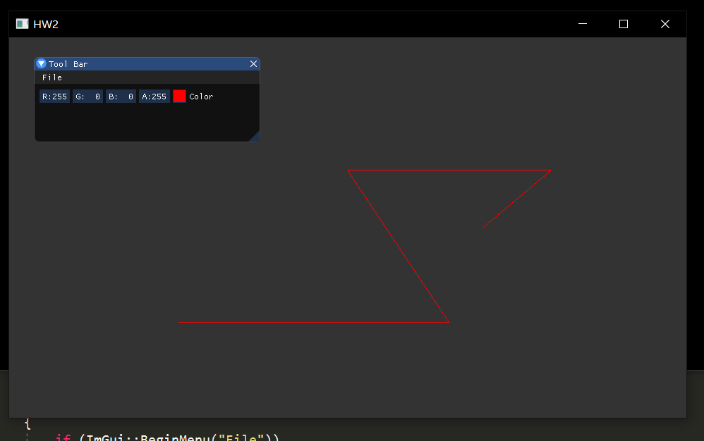
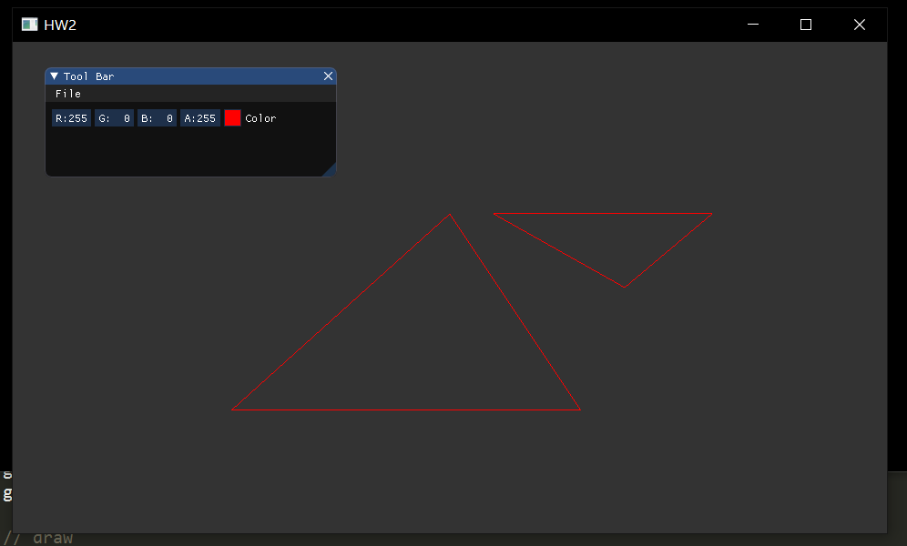

# 计算机图形学作业二

./src 下是代码
./doc 下是报告和截图

## 基本框架实现

环境变量配置完成后（OpenGL3.3, glew3, glad），首先要先显示一个“hello world”，而这里的hello world就是显示三角形。

基本的代码结构如下：

* main.cpp 程序主函数
* shader.h 负责操作用户自定义着色器的加载，编译和变量传递
* 两个着色器文件 GLSL

我的代码结构照着LearnOpenGL布置，因为是最基本的代码框架，我的代码完全照着教程抄。OpenGL的渲染流程主要实现在main.cpp中，具体如下：
```
初始化glfw
创建窗口和上下文，绑定窗口尺寸回调
用glad加载函数指针
调用Shader类加载着色器代码（文件读取，编译，链接）
绑定数据（VAO, VBO, EBO）
渲染循环（处理输入，清屏，绘制，交换缓冲）
结束（释放内存）
```


其中OpenGL的图形渲染管线（graphics pipeline）规定用户至少需要自定义顶点着色器和片段着色器；着色器用GLSL语言编写，有输入和输出变量，同名同类型的in变量和out变量可以在着色器间传递，还有一种类似于全局变量的uniform变量，可以在渲染进行时改变uniform变量的数据。

## 作业要求实现

### 绘制三角形

完成基本框架后，规定三个顶点的位置数据，我采用EBO索引数据绘制出三角形，位置数据从最初的float[]传入vertex shader，这样顶点的位置数据就固定在了shader progam中，最后绘制到屏幕上。

### 绘制一个三角形，三个顶点分别设为红绿蓝

在上一步三个顶点的数据后面加入颜色数据，并修改链接顶点属性的参数，现在一个定点数据的步长Stride是6个float的长度，最后在顶点着色器中加入一个location=1的vec3颜色数据并传给片段着色器。



虽然只规定了三角形三个顶点的颜色为红绿蓝，但是三角形内部的颜色是渐变的效果，这是因为着色器绘制三角形时在光栅化(Rasterization)阶段其实绘制了很多个小三角形，每个三角形的颜色都根据坐标和给定的顶点颜色进行了片段插值，所以最后得到这样的效果。

### 添加一个UI使用户可以控制三角形颜色

使用IMGUI，配置环境需要把imgui的所有.h和.cpp文件添加到项目中。IMGUI的使用步骤大致是初始化——渲染循环中配置——结束后销毁，绑定一个vec4变量，再在片段着色器中加入一个uniform变量，在渲染循环中通过shader.h修改这个变量就可以实现用户从IMGUI空间输入的颜色和着色器渲染的颜色绑定了。



### 使用EBO绘制多个三角形

在顶点数据中写好6个顶点，然后在索引数据中按序写入012和345，在绑定数据时绑定EBO的数据即可。



### 绘制其他图元

只需更改render loop中的`glDrawArrays(GL_TRIANGLES, 0, 3);` 或 `lDrawElements(GL_TRIANGLES, 6, GL_UNSIGNED_INT, 0)` （分别对应绘制VBO和EBO）的第一个参数即可，可以改为点或线等其他图元，OpenGL会根据参数对顶点进行对应绘制。



或者可以在render loop外配置`glPolygonMode(GL_FRONT_AND_BACK, GL_LINE);`以采用线框模式绘制。

