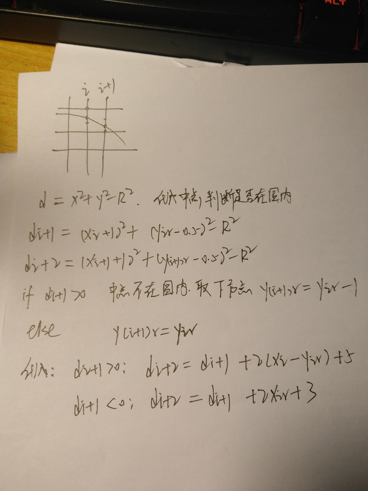

# 计算机图形学作业三

* 使用Bresenham算法画一个三角形边框
* 使用Bresenham算法画一个圆
* 添加可操控的GUI
* 对三角形进行光栅化，对内部进行着色

## 原理

### Bresenham算法

Bresenham算法是一种直线的扫描算法，算法步骤中只含有整数运算，避免了浮点运算和除法运算的开销。这次作业用到的是Bresenham直线算法和Bresenham圆形算法，两个算法的基本思想类似，用下一纵坐标与网格中点进行比较，且推导都可以用递归进行，我自己的推导如下：

直线算法d的初始值是，即代入(0, 0)点：

```cpp
d0 = 2dy - dx
```


圆形算法最后要把下面推导的d式子同乘2，最后初始值代入(0, R):

```cpp
d0 = 3 - 2R
```



需要注意的是，直线算法的要求是deltax为正，且直线斜率m需要在0-1之间，即直线需要在第一象限的下半部分；圆形算法的要求是在第一象限的上半部分。实现过程中需要对其他象限进行坐标变换。

### 三角形光栅化

三角形光栅化指给定三个顶点，对三角形边框和内部的所有像素进行填充。一种光栅化算法是沿着三角形边缘进行遍历，Edge Walking，但是这种方法依赖于边缘斜率，对特殊情况的处理比较麻烦。

另一种算法是，首先根据顶点找出包围三角形的最小矩形框，再遍历判断像素点是否在三角形内。

至于判断点是否在三角形内，可以用同侧法（三个顶点顺序生成的边框直线方程）进行判断，也可以用重心法用向量进行判断。

边缘方程：将三角形的三个顶点p1，p2，p3以1-2，2-3，3-1这样的依次顺序进行连接，求出`Ax + By + C = 0`形式的直线方程，代入待判断的像素坐标，若方程左边=0，说明点在直线上，若>0，在直线右侧，否则在直线左侧。依次计算出三个直线方程后，对每个顶点进行三次计算，结果若同号，则点在三角形内。这个方法最重要的是直线方程生成时需要按顺序生成，否则判断时同号无效。

```cpp
int lineParams[9];
lineParams[0] = triangleVertices[3] - triangleVertices[1]; 
lineParams[1] = triangleVertices[0] - triangleVertices[2];
lineParams[2] = triangleVertices[2] * triangleVertices[1] - triangleVertices[0] * triangleVertices[3];
lineParams[3] = triangleVertices[5] - triangleVertices[3];
lineParams[4] = triangleVertices[2] - triangleVertices[4];
lineParams[5] = triangleVertices[4] * triangleVertices[3] - triangleVertices[2] * triangleVertices[5];
lineParams[6] = triangleVertices[1] - triangleVertices[5];
lineParams[7] = triangleVertices[4] - triangleVertices[0];
lineParams[8] = triangleVertices[0] * triangleVertices[5] - triangleVertices[4] * triangleVertices[1];
...
int p1 = lineParams[0] * x + lineParams[1] * y + lineParams[2];
int p2 = lineParams[3] * x + lineParams[4] * y + lineParams[5];
int p3 = lineParams[6] * x + lineParams[7] * y + lineParams[8];
if ((p1 >= 0 && p2 >= 0 && p3 >= 0) || (p1 <= 0 && p2 <= 0 && p3 <= 0)) 
 ...
```

重心法：以三角形的一个顶点作为原点，若点在三角形内，这个点从原点引的向量可以用相邻的两条边表示，`uv1 + vv2`，这其中的两个变量，满足`u>=0, v>=0, u+v<=1`，用三个顶点坐标构成向量计算u和v的表示即可进行判断。这种方法和边缘方程的方法我运行的快慢比较接近。

```cpp
bool isInTriangle(int x, int y) {
	float x0 = triangleVertices[4] - triangleVertices[0], y0 = triangleVertices[5] - triangleVertices[1];
	float x1 = triangleVertices[2] - triangleVertices[0], y1 = triangleVertices[3] - triangleVertices[1];
	float x2 = x - triangleVertices[0], y2 = y - triangleVertices[1];

	float temp_00 = x0 * x0 + y0 * y0;
	float temp_01 = x0 * x1 + y0 * y1;
	float temp_02 = x0 * x2 + y0 * y2;
	float temp_11 = x1 * x1 + y1 * y1;
	float temp_12 = x1 * x2 + y1 * y2;

	float u = float(temp_11 * temp_02 - temp_01 * temp_12) / (float)(temp_00 * temp_11 - temp_01 * temp_01);
	float v = float(temp_00 * temp_12 - temp_01 * temp_02) / (float)(temp_00 * temp_11 - temp_01 * temp_01);
	if (u + v <= 1 && u >= 0 && v >= 0) return true;
	return false;
}
```

## 实现

结果如下：


只使用OpenGL的点绘制函数，所以核心部分是找出要绘制的点坐标。而2D绘制时使用的坐标是-1~1之间的屏幕坐标，所以需要对像素坐标到屏幕坐标之间进行转换：

```cpp
float stepx = (float)2 / (float)SCR_WIDTH;
float stepy = (float)2 / (float)SCR_HEIGHT;

...
// 算法完成后进行转换
for (int i = 0; i < points.size(); i += 2) {
	points[i] = (float)(points[i] * 2) / (float)SCR_WIDTH;
	points[i+1] = (float)(points[i+1] * 2) / (float)SCR_HEIGHT;
}
```

直线绘制就是遍历x，根据算法依次决定y坐标：

```cpp
// core
int d = 2 * deltay - deltax;
points.push_back(x0);
points.push_back(y0);
int y = y0;
for (int x = x0; x < x1; x++) {
	if (d >= 0) {
		y ++;
		d = d + 2 * (deltay - deltax);
	}
	else {
		d = d + 2 * deltay;
	}
	points.push_back(x + 1);
	points.push_back(y);
}
```

但是这只适用于第一象限一半的直线，对于其他象限，需要进行坐标变换，大致就是最后把所有其他象限的直线都转换到这个第一象限的下半部分，计算完成后再变换回去，最后全部放入vector中：

```cpp
if (deltax < 0 && deltay < 0) {
	deltax = -deltax;
	deltay = -deltay;
	int tem = x0; x0 = x1; x1 = tem;
	tem = y0; y0 = y1; y1 = tem;
}
bool flipSecondQuadrant = false;
if (deltax < 0 && deltay > 0) {
	flipSecondQuadrant = true;
	deltax = -deltax;
	x0 = -x0; x1 = -x1;
}
bool flipFourthQuadrant = false;
if (deltax > 0 && deltay < 0) {
	flipFourthQuadrant = true;
	deltay = -deltay;
	y0 = -y0; y1 = -y1;
}
bool flipFirstQuadrant = false;
if (deltay > deltax) {
	flipFirstQuadrant = true;
	int tem = deltax; deltax = deltay; deltay = tem;
	tem = x0; x0 = y0; y0 = tem;
	tem = x1; x1 = y1; y1 = tem;
}
```

若之前使用了屏幕像素坐标进行计算，需要在最后进行转换，然后把这些点绘制出来即可。

圆形算法基本只有核心部分不同:

```cpp
int x0 = 0;
int y0 = circler;
int d = (x0 + 1)*(x0 + 1) + (y0 - 0.5)*(y0 - 0.5) - circler * circler;
int y = y0;
points.push_back(x0);
points.push_back(y0);
for (int x = x0; x < circler * sqrt(2) / 2; x++) {
	if (d >= 0) {
		y--;
		d = d + 2 * (x - y) + 5;
	}
	else {
		d = d + 2 * x + 3;
	}
	points.push_back(x + 1);
	points.push_back(y);
}
```

光栅化三角形的实现中，我实现了原理中提到的两种判断点是否在三角形的方法 —— 边缘方程和向量方法：

```cpp
std::vector<float> points;
for (int x = minx; x <= maxx; x++) {
	for (int y = miny; y < maxy; y++) {
		int p1 = lineParams[0] * x + lineParams[1] * y + lineParams[2];
		int p2 = lineParams[3] * x + lineParams[4] * y + lineParams[5];
		int p3 = lineParams[6] * x + lineParams[7] * y + lineParams[8];
		if ((p1 >= 0 && p2 >= 0 && p3 >= 0) || (p1 <= 0 && p2 <= 0 && p3 <= 0)) {
		//if (isInTriangle(x, y)) {
			points.push_back(x);
			points.push_back(y);
		}
	}
}
```

---

## softRenderer补充：判断一个点是否在三角形内的方法

### 方法一：同侧法（Same Side Technique）

同侧法有两种思路：第一种，如作业的原理部分所述，三角形的边采用统一顺序，则三角形内的点相对于三条边都在同一侧（比如以顺时针构造边，三角形内的点在每一条边的右侧），可以通过计算边缘方程来判断了。

另一种思路是，对于三角形ABC的一条边AB，三角形内的一点P一定和C相对于AB在同一侧，而这个同侧可以用`t1 = PA cross AB, t2 = CA cross AB, dot(t1, t2) >= 0?`来判断，对三条边依次判断即可。

### 方法二：重心法（Barycentric Technique）

以三角形的两条边BA, CA作为向量，A到任一点P的向量PA总可以表示为`PA = u * BA + v * CA`，若P在三角形内，则uv必须满足`(u >= 0) && (v >= 0) && (u + v <= 1)`，这样就可以通过PABC四个点的坐标求出uv来判断了。

[参考博客，两种方法讲得很清楚](http://blackpawn.com/texts/pointinpoly/default.html)

## softRenderer补充2

[这里](https://www.scratchapixel.com/lessons/3d-basic-rendering/rasterization-practical-implementation)讲到应用中的GPU都是用bounding box来判断像素点是否在三角形内的，而且为了速度，都把坐标转换成int计算，但现代GPU都有FPU，所以不必再转换为int。

[这篇文章也讲到了重心法](https://www.scratchapixel.com/lessons/3d-basic-rendering/rasterization-practical-implementation/rasterization-stage)
