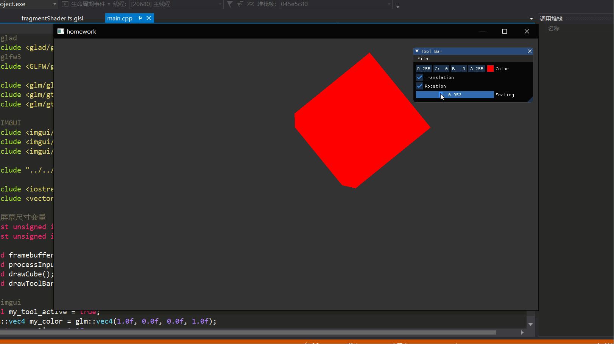

# 计算机图形学作业四

* 画立方体并探究深度测试的作用
* 对立方体进行平移，旋转，放缩操作
* 添加可操控的GUI
* 对渲染管线的理解

## 原理

OpenGL的渲染管线中坐标转换的顺序是：

```
Local space - World space - View/Eye/Camera space - 
Clip space -（Vertex Shader结束），剪裁，进行透视除法得到NDC坐标，
此时xy是屏幕坐标，z是深度值 - 视口变换 - （进行光栅化/Fragment Shader开始）
```

这部分管线中有三个部分是可编程的：Vertex Shader， Geometry Shader，Fragment Shader，其中顶点着色器主要处理坐标位置的部分，把顶点从局部空间转换到剪裁空间，转换的过程通常用到三个矩阵：Model，View，Projection。之前作业的绘制都是在2D空间中进行，实际上是直接把图形的坐标赋值为剪裁空间的坐标，这次作业要绘制3D物体，就需要完整地使用这三个矩阵，在顶点着色器中实现从局部坐标 - 世界坐标 - 相机坐标 - 剪裁坐标的转换。

## 实现

结果如下：



正方体的绘制我用了element buffer，绘制步骤和前几次作业一样。

```cpp
void drawCube()
{
	float vertices[] = {
		-2.0f, -2.0f, -2.0f,
		2.0f, -2.0f, -2.0f,
		2.0f, 2.0f, -2.0f,
		-2.0f, 2.0f, -2.0f,
		-2.0f, -2.0f, 2.0f,
		2.0f, -2.0f, 2.0f,
		2.0f, 2.0f, 2.0f,
		-2.0f, 2.0f, 2.0f
	};
	unsigned int indices[] = {
		0, 1, 2, // back face
		0, 2, 3,
		5, 1, 2, // right face
		5, 2, 6,
		7, 6, 2, // top face
		7, 2, 3,
		4, 5, 6, // front face
		4, 6, 7,
		0, 4, 7, // left face
		0, 7, 3,
		0, 1, 5, // bottom face
		0, 5, 4
	};

	unsigned int VBO, VAO, EBO;
	glGenBuffers(1, &VBO);
	glBindBuffer(GL_ARRAY_BUFFER, VBO);
	glBufferData(GL_ARRAY_BUFFER, sizeof(vertices), vertices, GL_STATIC_DRAW);
	glGenVertexArrays(1, &VAO);
	glBindVertexArray(VAO);
	glEnableVertexAttribArray(0);
	glVertexAttribPointer(0, 3, GL_FLOAT, GL_FALSE, 3 * sizeof(float), (void*)0);
	glGenBuffers(1, &EBO);
	glBindBuffer(GL_ELEMENT_ARRAY_BUFFER, EBO);
	glBufferData(GL_ELEMENT_ARRAY_BUFFER, sizeof(indices), indices, GL_STATIC_DRAW);

	glBindVertexArray(VAO);
	glDrawElements(GL_TRIANGLES, 36, GL_UNSIGNED_INT, 0);
}
```

view和projection矩阵在每一帧都是一样的，其中view相当于让场景后退，projection用到了透视投影：

```cpp
glm::mat4 view = glm::mat4(1.0f);
glm::mat4 projection = glm::mat4(1.0f);
view = glm::translate(view, glm::vec3(0.0f, 0.0f, -15.0f));
projection = glm::perspective(glm::radians(45.0f), (float)SCR_WIDTH / (float)SCR_HEIGHT, 0.1f, 100.0f);
myShader.setMat4("view", view);
myShader.setMat4("projection", projection);
```

坐标变换的实现都在model矩阵中，需要注意的是变换的顺序和矩阵左乘的顺序是相反的，这是由于矩阵乘法的特性规定的。所以这里有平移、旋转、缩放操作，我在矩阵乘法的顺序是 旋转矩阵 * 平移矩阵 * 缩放矩阵，实际上相当于先缩放，再平移，最后旋转：

```cpp
glm::mat4 model = glm::mat4(1.0f);
//model = glm::rotate(model, glm::radians(45.0f), glm::vec3(1.0, 1.0, 1.0));
if (my_rotation) {
	model = glm::rotate(model, float(sin(glfwGetTime())), glm::vec3(0.0, 0.0, 1.0));
}
if (my_translation) {
	model = glm::translate(model, glm::vec3(5.0f * float(sin(glfwGetTime())), 0.0, 0.0));
}
model = glm::scale(model, glm::vec3(my_scaling));
```

得到的效果就是gif中的正方体绕着z轴旋转，GUI中可以控制这三种变换的开关。

深度测试的作用是根据NDC中的z值显示z值最小的像素，即实际上离观察点最近的像素，这样就不会出现正方体的背面显示在正面之前的情况，但是这里因为我画的正方体是纯色的，看不出来背面显示在正面之前的效果。