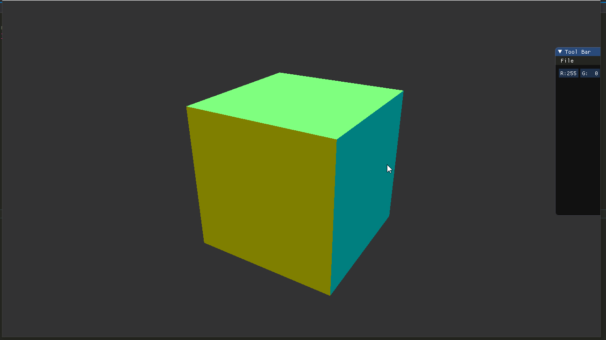

# 计算机图形学作业五

## 实现

**把上次作业绘制的cube放置在(-1.5, 0.5, -1.5)位置，要求6个面颜色不一致**

在正方体的顶点数据中加入法向量，在片段着色器中根据法向量归一化到0，1之间的值作为顶点颜色值，这样六个面的颜色就不同了，这里用的是透视投影：


**正交投影(orthographic projection)：实现正交投影，使用多组(left, right, bottom, top, near, far)参数， 比较结果差异**

正交投影矩阵用如下参数：

```cpp
projection = glm::ortho(-16.0f, 16.0f, 9.0f, -9.0f, -1.0f, 1.0f);
```

并把正方体旋转45度，得到结果如下:


若不旋转，但仍保持正交投影矩阵参数的宽高比和屏幕一样（16:9），可以得到一个正方形：


 **把cube放置在(0, 0, 0)处，做透视投影，使摄像机围绕cube旋转，并且时刻看着cube中心**

view矩阵的代码：

```cpp
float camPosX = sin(glfwGetTime()) * 10.0f;
float camPosZ = cos(glfwGetTime()) * 10.0f;
view = glm::lookAt(glm::vec3(camPosX, 5.0, camPosZ), glm::vec3(0.0, 0.0, 0.0), glm::vec3(0.0, 1.0, 0.0));
```

效果：



**在现实生活中，我们一般将摄像机摆放的空间View matrix和被拍摄的物体摆设的空间Model matrix分开，但是在OpenGL中却将两个合二为一设为ModelView matrix，通过上面的作业启发，你认为是为什么呢？在报告中写入。（Hints：你可能有不止一个摄像机）**

固定管线的ModelView矩阵相当于封装了从物体的局部坐标到相机坐标的转换，这样对于多个相机，只需要对应选取ModelView矩阵就可以了，使用起来比较简单；可编程管线把这两个矩阵分开，提供了更高的编程灵活性，只要熟知每一个矩阵的作用一样可以很方便的使用。

### **欧拉角实现FPS相机**


Camera类的变量如下：

```cpp
glm::vec3	position, worldup;
glm::vec3	front, up, right;
GLfloat		keyboardVelocity, mouseVelocity;
GLfloat     pitch, yaw;
```

相机坐标的系初始状态是z轴向屏幕内的坐标系，即和世界坐标系的z轴方向相反，坐标系用front，up，right三个变量规定，由于相机的right变量始终与世界坐标系的正上方正交（欧拉角变化中roll变量没有变化），因此worldup变量会在更新相机坐标系时用到。

相机的前后左右移动根据方向更新position变量即可：

```cpp
void moveForward(GLfloat const dt)
{
	this->position += this->front * dt * this->keyboardVelocity;
}
void moveBack(GLfloat const dt)
{
	this->position -= this->front * dt * this->keyboardVelocity;
}
void moveRight(GLfloat const dt)
{
	this->position += this->right * dt * this->keyboardVelocity;
}
void moveLeft(GLfloat const dt)
{
	this->position -= this->right * dt * this->keyboardVelocity;
}
```

比较复杂的是实现FPS相机的鼠标控制镜头效果。这里采用欧拉角实现，记录相机的pitch和yaw变量，pitch指相机绕x轴旋转的角度，yaw指绕y轴旋转的角度。

首先需要获取鼠标的偏移量，再转换成pitch和yaw的值。偏移量是屏幕坐标xy方向的分量，可以理解为相机坐标系中单位元上的弧长变化，而巧妙的是由于半径为1，弧长计算圆心角度数的结果是角度等值于弧长值，因此xy方向的偏移量可以直接作为yaw和pitch的角度值。（y方向用lastY - ypos因为屏幕坐标系的y轴是从上至下的）

有了pitch和yaw的值，接下来需要更新相机参数。代码中一个奇怪的地方是：yaw的初始值设为-90，而pitch初始值为0。这是由front变量初始值是(0, 0, -1)决定的。

```cpp
front.x = cos(glm::radians(Yaw)) * cos(glm::radians(Pitch));
front.y = sin(glm::radians(Pitch));
front.z = sin(glm::radians(Yaw)) * cos(glm::radians(Pitch));
```

上面是计算front的代码，pitch初始为0，y初始也为0。而为了让z初始为-1，且满足yaw变大时x变大z变小，只有yaw为-90才可以，因此pitch和yaw的初始值就说通了，几何上看就是让yaw的原点在x轴正向，pitch的原点在y轴旋转到xz平面上。

这样就实现了鼠标移动的效果，还有几个小hack是：为了避免首次把鼠标移入屏幕相机飘走，把第一次移入的鼠标位置作为相机pitch和yaw的原点；锁定pitch值不能超过90或-90。

### **四元数实现相机**

大致和欧拉角实现的相同，只是用四元数计算旋转部分。

四元数计算旋转角度也是用pitch和yaw分量进行计算，但是采用了四元数直接得到旋转矩阵，因此初始条件有些不同，首先明确欧拉角的正负方向：

*   Yaw 表示偏航角，绕 Y （上）轴 (0,1,0)(0,1,0) 旋转。头部左转表示为正，右转表示为负。
*   Pitch 表示俯仰角，绕 X （右）轴 (1,0,0)(1,0,0) 旋转。抬头表示为正，低头表示为负。
*   Roll 表示翻滚角，绕 Z ( 前）轴 (0,0,1)(0,0,1) 旋转。头部向左倾斜表示为正，向右倾斜表示为负。

因此在第一种欧拉角的旋转计算中，yaw的旋转在左转时才是正向，因此要把yaw的变化取反，pitch就是向上为正，保持不变；。另一个问题是要把pitch和yaw的初始值都设置为0，因为这里的旋转起点就是front的初始值，所以旋转的值始终是(0, 0, -1)这个向量。这样就得到了欧拉角参数的四元数，用这个四元数旋转初始front向量即可。

```cpp
void rotate(GLfloat dpitch, GLfloat dyaw)
{
	pitch += dpitch * this->mouseVelocity;
	yaw -= dyaw * this->mouseVelocity;

	if (pitch > 89.0f)
		pitch = 89.0f;
	if (pitch < -89.0f)
		pitch = -89.0f;

	glm::quat key_quat = glm::quat(glm::vec3(glm::radians(pitch), glm::radians(yaw), 0));

	this->front = glm::rotate(key_quat, glm::vec3(0, 0, -1));
	this->front = glm::normalize(this->front);

	this->right = glm::cross(this->front, this->worldup);
	this->up = glm::cross(this->right, this->front);
}
```

这里我们也对pitch的值进行了限制，pitch不能大于90或小于-90，因为在这个范围外会出现画面颠倒。