# 计算机图形学作业七

## 原理

Shadow Mapping是一种高效的实现阴影的方法，通过framebuffer先渲染得到场景相对于光源的depth map，即光线最先照射到的物体的深度缓存，然后正常渲染场景，将像素在光源坐标下的深度值与depth map比较，得到该像素是否处于阴影中。

## 实现

首先需要以点光源为视点渲染场景，以得到depth map，这次渲染不需要颜色数据，所以framebuffer只需要绑定纹理贴图即可。投影矩阵用的是正交投影，场景中绘制了一个平面，一个正方体和一个球体：

```cpp
// render scene into framebuffer from light's point of view
glBindFramebuffer(GL_FRAMEBUFFER, framebuffer);
glClearColor(0.2f, 0.2f, 0.2f, 1.0f);
glClear(GL_DEPTH_BUFFER_BIT);
depthShader.use();
glm::mat4 model = glm::mat4(1.0f);
glm::mat4 view = glm::mat4(1.0f);
glm::mat4 projection = glm::mat4(1.0f);
model = glm::translate(model, glm::vec3(-4.0, 2.5, -1.0));
model = glm::rotate(model, (float)sin(glfwGetTime()), glm::vec3(1.0, 1.0, 1.0));
model = glm::scale(model, glm::vec3(1.0));
depthShader.setMat4("model", model);
// light space matrix
glm::mat4 lightProjection, lightView;
glm::mat4 lightSpaceMatrix;
float near_plane = 1.0f, far_plane = 7.5f;
lightProjection = glm::ortho(-10.0f, 10.0f, -10.0f, 10.0f, near_plane, far_plane);
lightView = glm::lookAt(light_pos, glm::vec3(0.0f), glm::vec3(0.0, 1.0, 0.0));
lightSpaceMatrix = lightProjection * lightView;
depthShader.setMat4("lightSpaceMatrix", lightSpaceMatrix);
drawCube();
// plane
model = glm::mat4(1.0f);
model = glm::scale(model, glm::vec3(30.0, 0.1, 30.0));
depthShader.setMat4("model", model);
drawCube();
// sphere
model = glm::mat4(1.0f);
model = glm::translate(model, glm::vec3(1.5, 1.5, -1.0));
model = glm::scale(model, glm::vec3(1.0));
depthShader.setMat4("model", model);
drawSphere();
```

然后第二次渲染就和普通的渲染基本一样，这里用了Phong光照模型，场景中有一个点光源。生成阴影需要传入上一步用到的lightSpaceMatrix，将顶点转换到和depth map一样的坐标系，然后比较深度值，若处在阴影中，则不绘制diffuse和specular光照的效果，fragment shader计算阴影部分的代码如下：

```cpp
// 计算阴影
vec3 ndcCoords = FragPosLightSpace.xyz / FragPosLightSpace.w;
ndcCoords = (ndcCoords + 1.0) / 2;
//FragColor = vec4(vec3(ndcCoords.z), 1.0);
float closestDepth = texture(depthMap, ndcCoords.xy).r;
float currentDepth = ndcCoords.z;
float shadow = currentDepth > closestDepth ? 1.0 : 0.0;  

FragColor = vec4((ambient + (1.0 - shadow) * (diffuse + specular)) * objectColor, 1.0);
```

得到的效果如下：

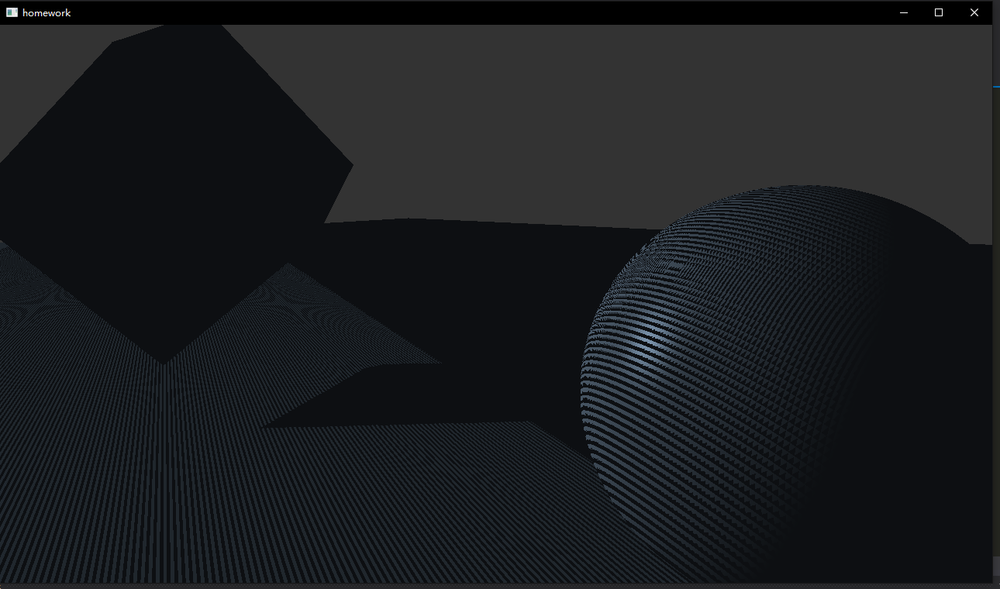

### **Shadow acne**

很明显在场景中充满了斑马线，这个效果叫做Shadow acne，是由于depth map的像素与面交错产生的，说到底是一种采样精度问题，下图很明白的解释了产生原理：


因此一种常用的hack是为depth值加上bias，且这个bias会随平面角度增大（其实手动找到合适的，足够大的bias也可以解决问题），其实就是相当于把depth map的值全部增大，原理图：


代码如下：

```cpp
float bias = max(0.05 * (1.0 - dot(norm, lightDir)), 0.005);  
float shadow = currentDepth - bias > closestDepth  ? 1.0 : 0.0;  
```

效果：

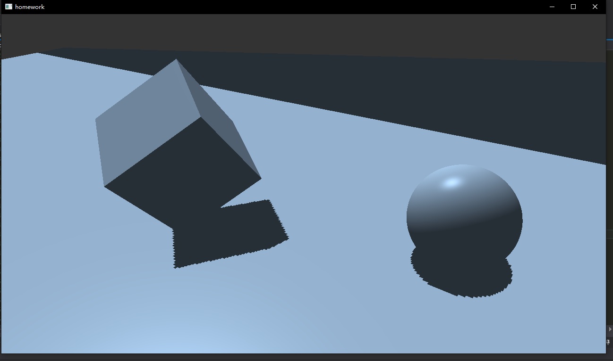

### **Peter panning**

为了解决Shadow acne，为depth map加上一个bias，会导致一个新问题：Peter panning——bias过大导致物体的阴影偏移：

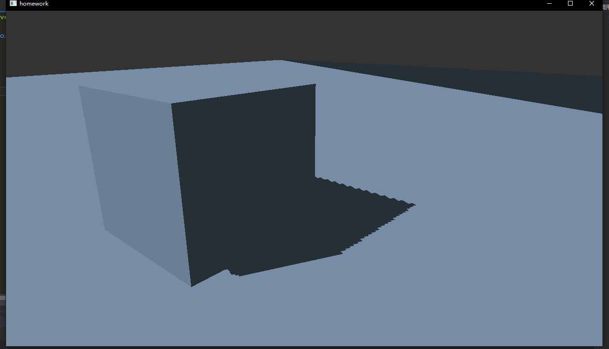

Peter panning目前发现了两种解决办法：

第一种，使用“Slope-Scale Depth Bias”，也就是Shadow acne中用到的根据角度变化的bias：

```cpp
float bias = max(0.05 * (1.0 - dot(norm, lightDir)), 0.005);
```

第二种，启用face culling，在渲染depth map的时候关闭face culling，渲染完后开启（或在渲染时设置剔除front face，渲染完成后还原为剔除back face，效果一样，LearnOpenGL教程中提到的front face culling应该就是这种方法），然后在depth map使用的fragment shader中只对位于正面的像素的深度值添加bias：

```cpp
// 生成depth map的fragment shader
gl_FragDepth = gl_FragCoord.z;
gl_FragDepth += gl_FrontFacing ? 0.05 : 0;
```

这种方法只对光源视角下的正面添加bias，在这个简单场景中就对plane和物体的正面添加bias，避免了shadow acne，而对物体的反面不添加bias，避免了peter panning。

解决后的效果：

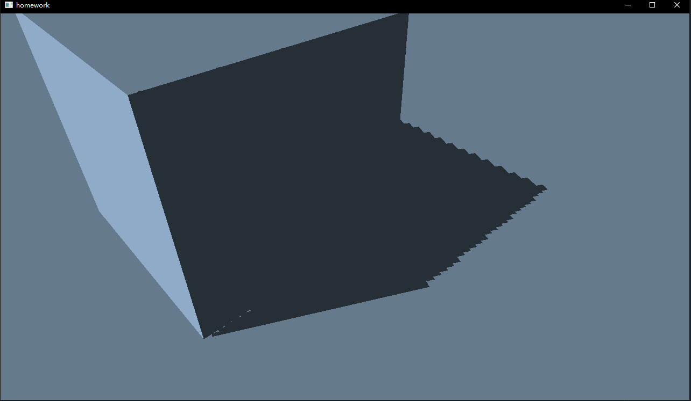

### **Over sampling**

在场景中远处会出现重复的阴影：

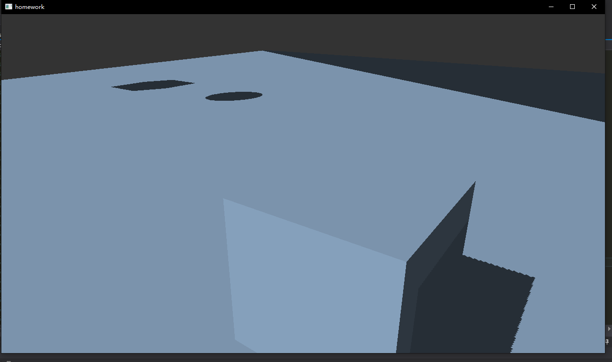

这是因为场景中在超出光照视锥体的部分对depth map采样，而材质的默认采样方式是GL_REPEAT，因此就会出现重复的阴影。解决办法是把超出的部分的深度值都设为1，即不会出现阴影：

```cpp
// set to this to avoid outside in shadow
glTexParameteri(GL_TEXTURE_2D, GL_TEXTURE_WRAP_S, GL_CLAMP_TO_BORDER);
glTexParameteri(GL_TEXTURE_2D, GL_TEXTURE_WRAP_T, GL_CLAMP_TO_BORDER);
float borderColor[] = { 1.0f, 1.0f, 1.0f, 1.0f };
glTexParameterfv(GL_TEXTURE_2D, GL_TEXTURE_BORDER_COLOR, borderColor);
```

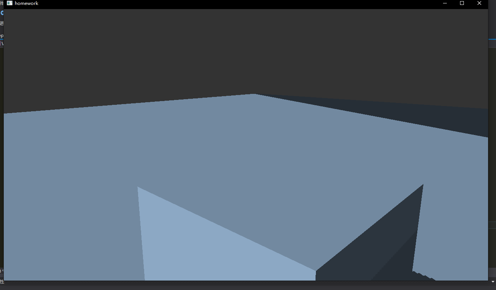

而现在在远处还有一部分阴影，这是由于超出光照视锥体的远平面导致的，在shadow mapping中，通常对光照远近平面的设定都比较小，以得到更高的精度，因此要处理超出远平面的部分。在第二遍的渲染管线中，用lightSpaceMatrix手动计算的z值不会进行剪裁，因此超出光源视锥体的像素z值会大于1，因此只要把这些大于1的像素单独处理即可：

```cpp
if(currentDepth > 1.0)
	shadow = 0;
else
{
	float bias = max(0.05 * (1.0 - dot(norm, lightDir)), 0.005);
	shadow = currentDepth - bias > closestDepth ? 1.0 : 0.0;  
}
```

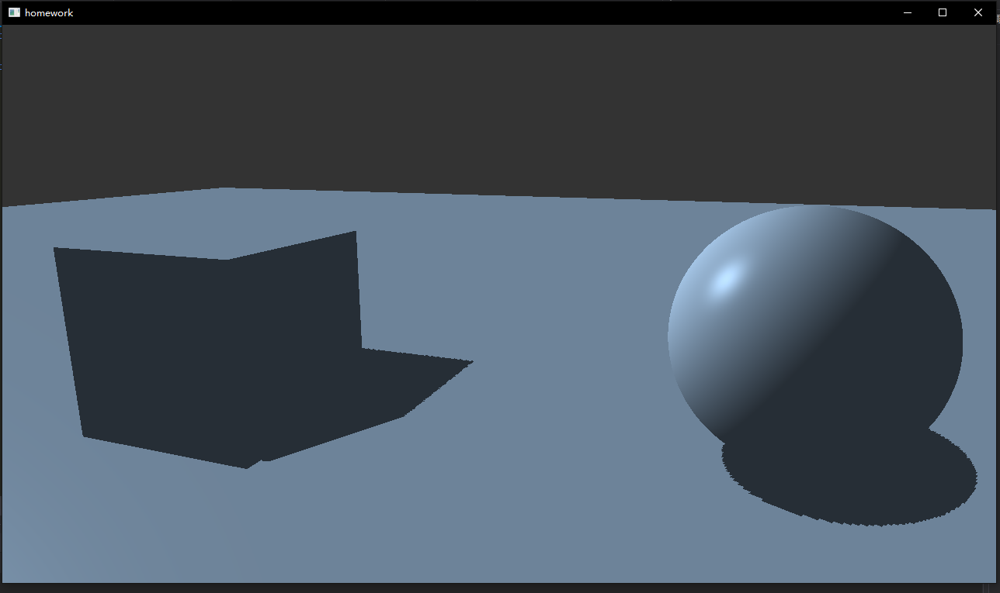

### **Perspective Aliasing**

阴影边缘有明显的锯齿，这是由于depth map的精度问题导致的，多个像素在depth map上采样到同一点，这个现象叫做Perspective Aliasing：

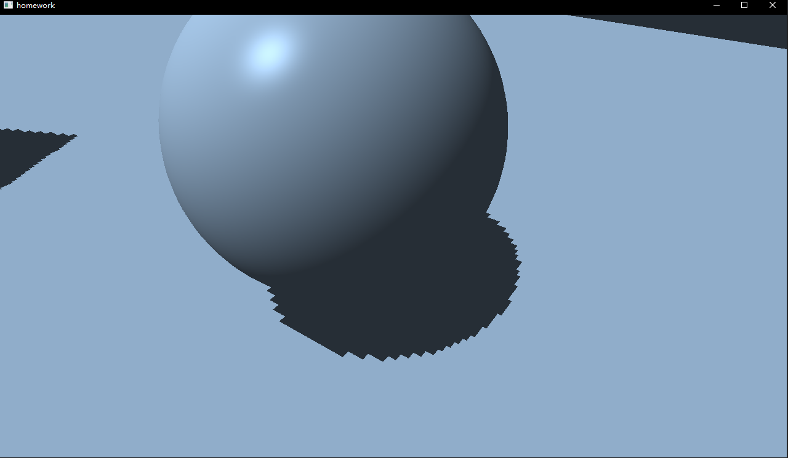

可以通过增大depth map的分辨率来改善阴影质量。把depth map的长和宽都增大一倍后：

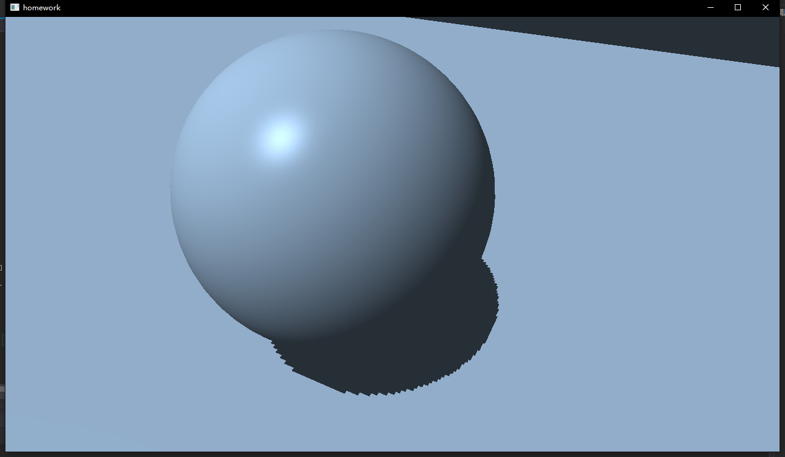

除了增大分辨率外，让near_plane 和 far_plane尽量接近也可以减少锯齿。

另一种方法是PCF(percentage-closer filtering)，基本的做法是对像素的周围depth map进行采样并平均，以平滑锯齿：

```cpp
// textureSize(depthMap, 0)返回depthMap在0级mipmap下的尺寸，即depthMap的尺寸
vec2 texelSize = 1.0 / textureSize(depthMap, 0);
for(int x = -1; x <= 1; ++x)
{
	for(int y = -1; y <= 1; ++y)
	{
		float pcfDepth = texture(depthMap, ndcCoords.xy + vec2(x, y) * texelSize).r; 
		shadow += currentDepth - bias > pcfDepth ? 1.0 : 0.0;        
	}    
}
shadow /= 9.0;
```

9次采样的效果：

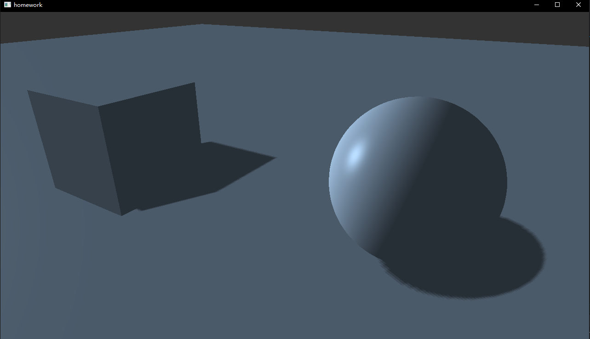

49次：

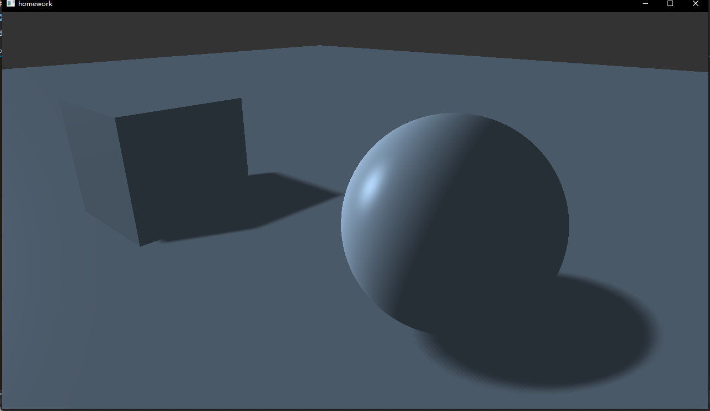

### Orthographic projection vs Perspective projection

在生成depth map时一般为方向光源使用正交投影，为点光源使用透视投影：

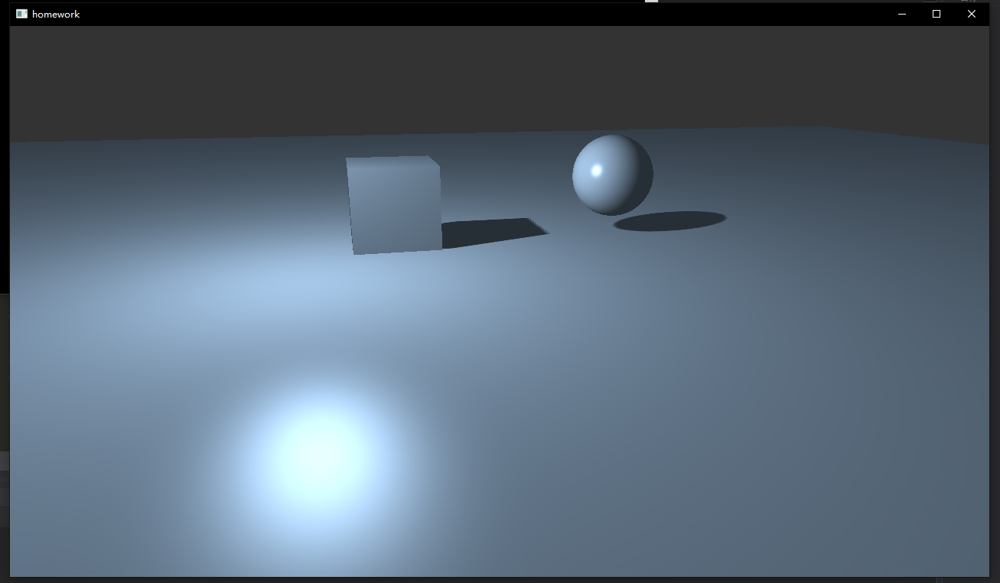

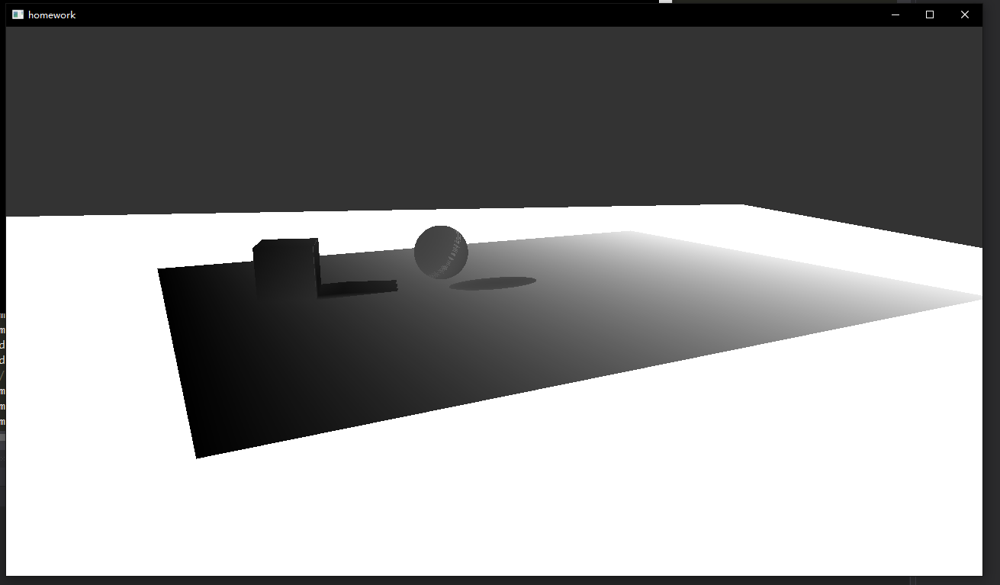

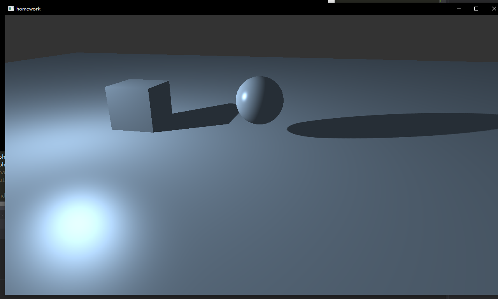

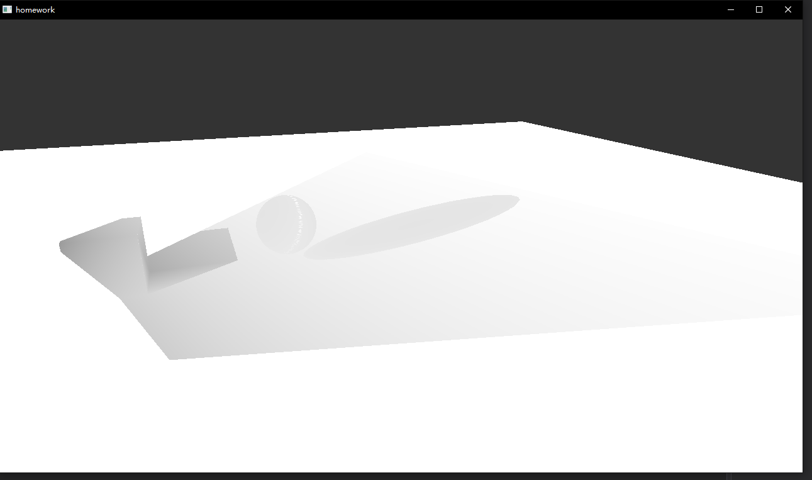

### **CSM(Cascaded Shadow Maps)**

为了解决Perspective Aliasing的问题，[参考](https://docs.microsoft.com/zh-cn/windows/desktop/DxTechArts/common-techniques-to-improve-shadow-depth-maps)提到了一些方法，其中采用更贴合相机投影视锥体的depth map可以得到更高的阴影精度，因此通过相机的视锥体计算光源投影的near_plane 和 far_plane就是一种提高阴影质量的方法，可以通过对两个视锥体求交，或通过最大和最小的深度值计算。

通常最常用，最好的办法是[CSM](https://docs.microsoft.com/zh-cn/windows/desktop/DxTechArts/cascaded-shadow-maps)，这个算法将相机视锥体划分为几个部分，每一部分分别生成一个depth map，在着色时选择对应的depth map计算阴影，其中划分场景和根据划分生成合适的depth map都有几种不同的方法：

* 划分cascade frustum的方法
  * fit to scene：使用相同的near plane，depth map部分重叠
  * fit to cascade：完全分割view frustum

这里实现的是参考这个[OpenGL教程中的实现](http://ogldev.atspace.co.uk/www/tutorial49/tutorial49.html)，这篇文章按照相机视锥体的z值将场景分为三个cascade，然后用简单的最小包围获得光源投影矩阵。文章的前半部分对CSM算法进行了一个完整的讲解，后半部分是关键代码，由于这套教程没有使用glm库，导致实现的时候需要对一些地方进行修改，接下来的部分对细节会详细展开。

首先明确CSM的步骤：
* 划分视锥体，计算光源投影矩阵
  * 以深度值划分相机视锥体，在view space进行
  * 将得到的子视锥体的8个顶点坐标转换回world space，再转换到光源视角的view space
  * 在光源view spcae中对这八个顶点计算最小包围的x，y，z值，从而构造光源的正交投影矩阵
* 和之前一样的shadow mapping步骤渲染所有的depth map
* 渲染场景及阴影
  * vertex shader中对顶点计算对所有cascade的光照坐标，以及相机坐标系中clip space的z值
  * fragment shader中用相机系的clip sace z值判定顶点位于哪一级cascade
  * 使用对应cascade的坐标和depth map获得阴影信息
  * 其余步骤（PCF等）和之前一样

#### **相机投影矩阵参数**

实现过程中，在计算光源投影矩阵计算遇到了问题。这里需要在view space计算分割视锥体的顶点，需要用到field of view视角值，且需要和相机投影矩阵用到的一样：

```cpp
projection = glm::perspective(glm::radians(fov), (float)SCR_WIDTH / (float)SCR_HEIGHT, near_plane, far_plane);
```

但是这个fov是横向的视角还是纵向的视角？由于在参考的教程里使用的是自定义数学库，即自定义了glm
::perspective，那里的默认是fov代表横向视角，**但是glm9.9.3使用的fov是纵向视角**：

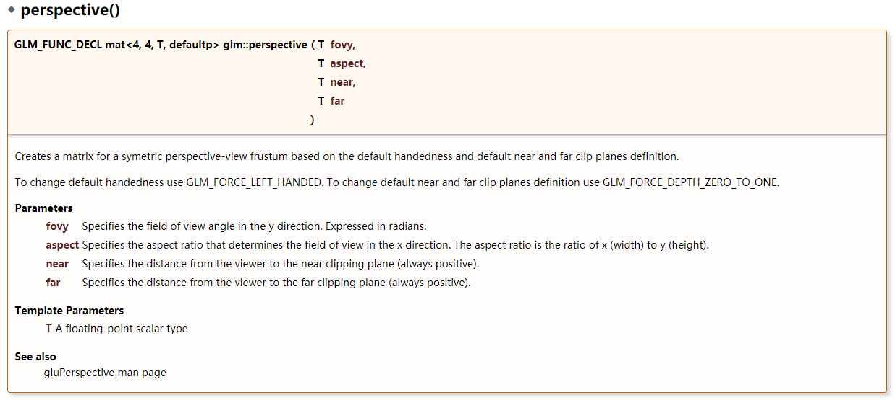

fov是y方向的视角值（不是半角），aspect是宽高比。因此在实现时用到了glm::perspective参数一样的fov，就要把它当作y方向的视角值：

```cpp
float ar = (float)SCR_WIDTH / (float)SCR_HEIGHT;
float tanHalfHFOV = tanf(glm::radians(fov * ar / 2.0f));
float tanHalfVFOV = tanf(glm::radians(fov / 2.0f));
```

#### **view space坐标**

得到了cascade视锥体近远平面的x，y，z值，接下来要以此构造8个顶点，在OpenGL中通常使用的都是右手系，即**world sapce，view space的坐标轴一样都是右手系，z轴朝外**，而clip space和NDC的z轴朝内，因此得到的zn和zf需要取符号作为坐标值：

```cpp
glm::vec4 frustumCorners[8] = {
	glm::vec4(xn, yn, -zn, 1.0),
	glm::vec4(-xn, yn, -zn, 1.0),
	glm::vec4(xn, -yn, -zn, 1.0),
	glm::vec4(-xn, -yn, -zn, 1.0),
	glm::vec4(xf, yf, -zf, 1.0),
	glm::vec4(-xf, yf, -zf, 1.0),
	glm::vec4(xf, -yf, -zf, 1.0),
	glm::vec4(-xf, -yf, -zf, 1.0)
};
```

#### **光源投影矩阵构造**

将视锥体的顶点转换回world space，再转换到光源的view space后，用AABB包围得到x，y，z的最大和最小值，需要以此构造正交投影矩阵。这里也存在和上一个问题一样的情况：z轴朝外，但是**glm::ortho参数中的near_plane 和 far_plane都是正数值**，这对与刚才得到的不确定正负的zmin 和 zmax来说就是无法使用的，因此只能自己实现ortho矩阵，参考了[这里](http://www.songho.ca/opengl/gl_projectionmatrix.html)的正交矩阵构造：

```cpp
float r = maxX, l = minX, t = maxY, b = minY, n = maxZ, f = minZ;
// glm::mat4初始化是按列的...
lightProjection[i] = glm::mat4(2.0f / (r - l),     0.0f,               0.0f,               0.0f,
							   0.0f,               2.0f / (t - b),     0.0f,               0.0f,
							   0.0f,               0.0f,               2.0f / (f - n),     0.0f,
							   -(r + l) / (r - l), -(t + b) / (t - b), -(f + n) / (f - n), 1.0f);
```

这样就完成了光源不同cascade投影矩阵的构造。在渲染场景时需要用到判断cascade的clip space z值也存在一样的正负问题，需要在计算和shader使用时保持一致。

剩下的部分按照参考教程中就可以实现了，且主要架构和不适用CSM的shadow mapping相似，最终得到效果：

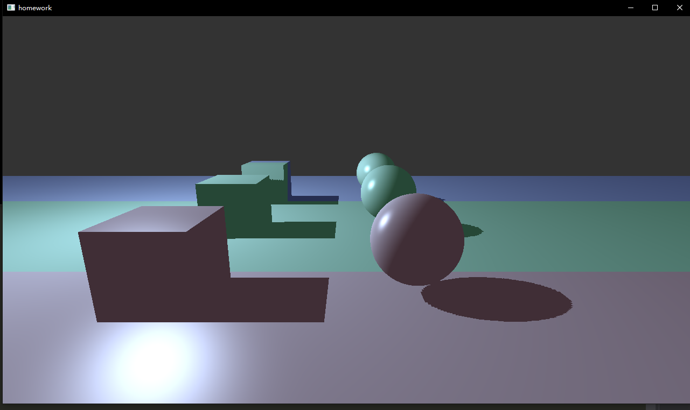

#### **GLSL uniform数组赋值**

GLSL中可以使用uniform变量的数组，只有在向shader传这个变量数组的值时有些不同。比如float数组，在常用的封装的shader.h中只对一个float变量赋值：

```cpp
glUniform1f(glGetUniformLocation(ID, name.c_str()), value);
```

使用的是glUniform1f函数，若想为float数组赋值，要使用glUniform1fv函数，多一个声明数组元素数量的参数，最后一个参数是数组的第一个元素的地址：

```cpp
glUniform1fv(glGetUniformLocation(pShader.ID, "cascadeEndClipSpace"), 3, &cascadeEndClipSpaceZ[0]);
```

矩阵数组同理，第三个参数是是否转置：

```cpp
glUniformMatrix4fv(glGetUniformLocation(pShader.ID, "lightSpaceMatrix"), 3, GL_FALSE, &lightSpaceMatrix[0][0][0]);
```

#### **阴影丢失**

这里的场景光源在左侧，物体在中间，当相机向右前放靠近后，向右转时，会发现有一部分阴影丢失了：

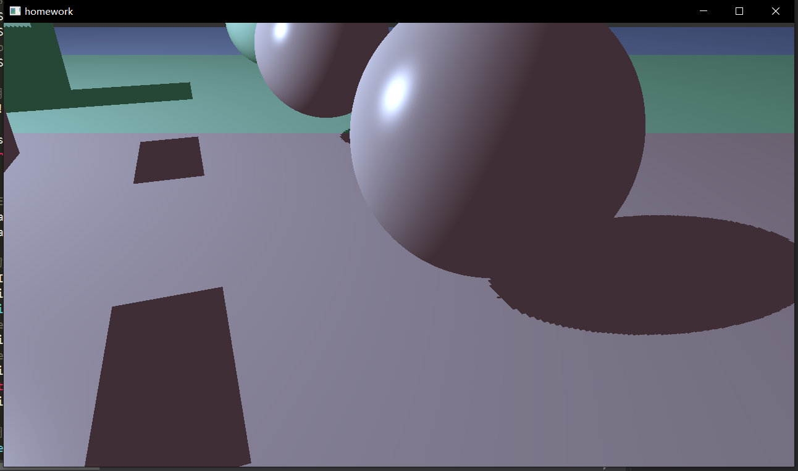

丢失的原因是，物体不在相机视锥体中，因而也可能不在光源视锥体中，因此depth map就没有这一部分的深度信息，因而导致了这一边缘部分的阴影丢失。这是由于选择cascade depth map时使用了紧密包围相机视锥体的方法，当把构造光源投影矩阵的远近平面略微增大后，这个丢失就不再出现了，但是要彻底解决这个问题，需要在构建cascade shadow map的时候采用不同的方法。

#### **seam between cascades**

在两个cascade的边界处有明显的边缘，并且在使用PCF后更加明显：

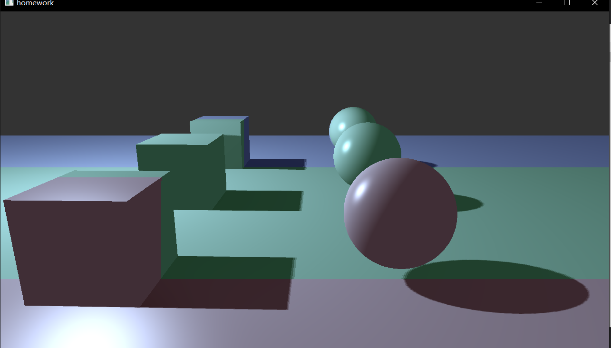

这是由于不同cascade连接处直接采用不同的depth map采样导致的，
[这里](https://www.gamedev.net/forums/topic/677330-cascaded-shadow-map-problem-seam-between-cascade/) 和 [这里](https://computergraphics.stackexchange.com/questions/5146/cascaded-shadow-maps-seams-between-cascades)是关于这个问题的讨论，常用的解决办法是让不同的depth map间有一些overlap，然后在生成阴影时进行blend：

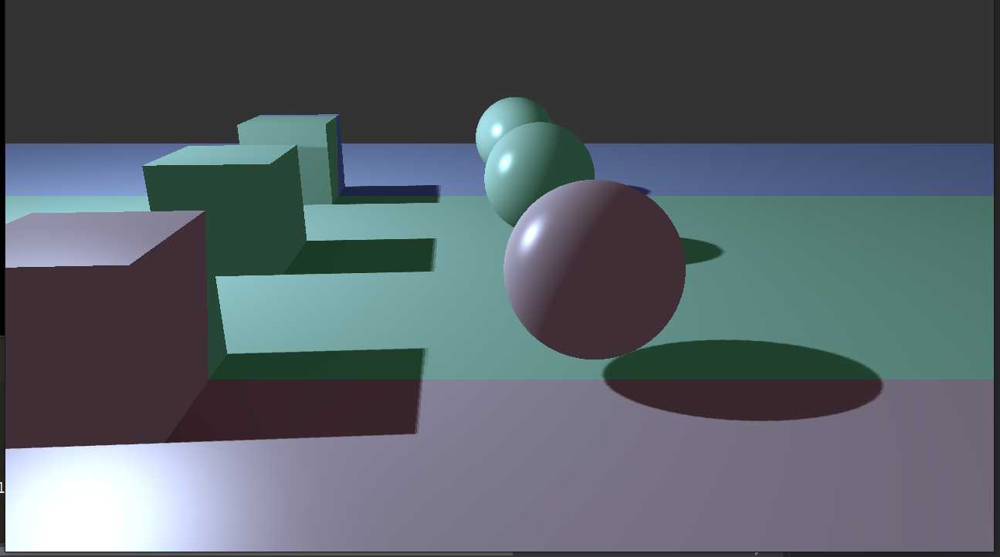

#### **shimming edges**

由于视锥体在不断地改变，导致阴影边缘会出现忽亮忽暗的现象，在微软的文章里有一个取整的解决办法，可以缓解shamming edges：

```cpp
// fix shimming edges
float xUnitPerTexel = (maxX - minX) / SHADOW_WIDTH;
float yUnitPerTexel = (maxY - minY) / SHADOW_HEIGHT;
minX = floor(minX / xUnitPerTexel) * xUnitPerTexel;
maxX = floor(maxX / xUnitPerTexel) * xUnitPerTexel;
minY = floor(minY / yUnitPerTexel) * yUnitPerTexel;
maxY = floor(maxY / yUnitPerTexel) * yUnitPerTexel;
/*minZ = floor(minZ / yUnitPerTexel) * yUnitPerTexel;
maxZ = floor(maxZ / yUnitPerTexel) * yUnitPerTexel;*/
```

根据depth map的长和宽对xy进行，但是不知道z是否需要取整，如果需要，如何操作。