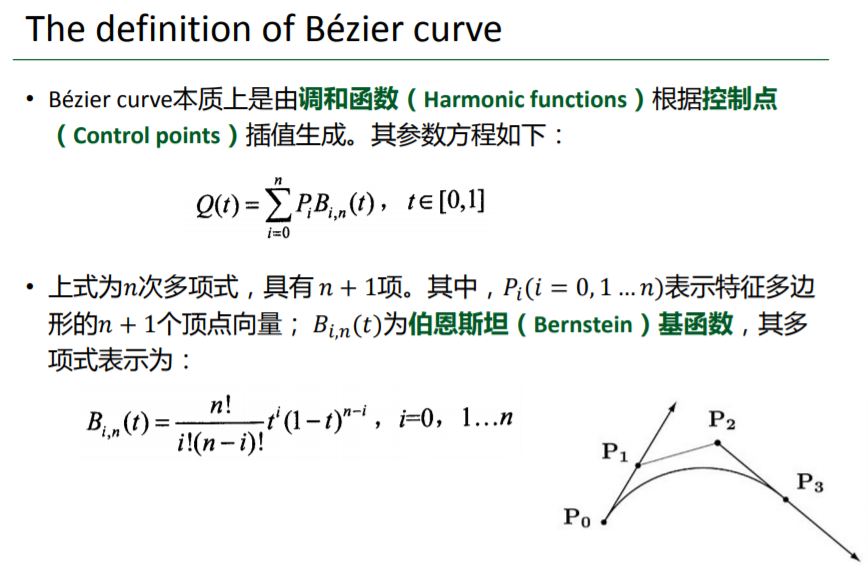
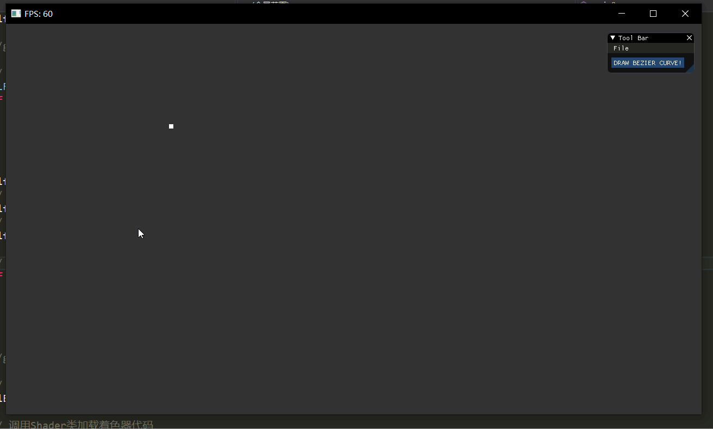

# 计算机图形学作业四

## 原理

Bezier曲线：



若有n+1个控制点，曲线的参数方程就是有n+1项的n次多项式。Bezier曲线有一个对绘制很重要的性质：曲线上的点总与控制点得到的一个直线相切。即：

```cpp
两个控制点，Bezier曲线的点就在P0到P1的线段上；
三个控制点，由三个控制点生成两个中间点（参数t从0到1），Bezier曲线的点就在这两个中间点相连的线段上；
四个控制点，用相同的方法生成下一层控制点，直到最后一层只有两个中间点，Bezier曲线就在这两个中间点的线段上。
...
```

如图：


利用这个特性，就可以通过计算每一层的中间点来绘制Bezier曲线。

## 实现



绘制曲线的核心部分在`drawCtrlPoints()`函数中：

```cpp
void drawCtrlPoints(float* points, int num, float t, Shader& shader)
{
	if (num == 2)
	{
		shader.setInt("pointSize", 8);
		drawPoint(points[0], points[1]);
	
		bezierPoints.push_back(points[0]);
		bezierPoints.push_back(points[1]);
		return;
	}

	float* tmpPoints = new float[num - 2];
	for (int i = 0; i < num - 2; i += 2)
	{
		shader.setInt("pointSize", 8);
		drawPoint(points[i], points[i + 1]);
		drawPoint(points[i + 2], points[i + 3]);

		shader.setInt("pointSize", 1);
		drawLine(points[i], points[i + 1], points[i + 2], points[i + 3]);

		tmpPoints[i] = (1 - t) * points[i] + t * points[i + 2];
		tmpPoints[i + 1] = (1 - t) * points[i + 1] + t * points[i + 3];
	}

	memcpy(points, tmpPoints, sizeof(float) * (num-2));
	delete tmpPoints;

	drawCtrlPoints(points, num - 2, t, shader);
}
```

函数绘制输入的控制点并两两连线，再将每一对邻接控制点对应生成的下一层控制点调用函数，以此递归调用，最终只有一个次层控制点时，这一个点就是曲线上的点。

捕捉鼠标的部分通过glfw的mouse callback实现，配合IMGUI就可以做到先用鼠标点击输入控制点，再点击按钮即可开始绘制。

### 性能问题

由于在每次遍历t绘制后将数据清零重新绘制，程序在几次绘制比较复杂的曲线后会卡死，说明在循环绘制的过程中出现了内存的不当使用。

首先检查递归函数，因为每一帧都要调用多次递归函数，极有可能是这里出现内存没有释放的问题，但是将内存合理释放并使用尾递归后，卡死的问题依然存在。

最终发现是由于绘制控制点的函数在绘制完毕后没有销毁VAO和VBO，在之前的程序中由于场景内容很小，不释放这些数据的空间没有问题，但是这里由于Bezier曲线在接近绘制完毕后可能有几百个点的数据，在每一帧都不释放内存必然会导致内存不够用，在`drawLine()`及`drawPoint()`函数最后都加上释放VBO和VAO，卡死的问题就不再出现：

```cpp
void drawPoint(float x0, float y0)
{
	float points[] = { x0, y0 };

	unsigned int VBO, VAO;
	glGenBuffers(1, &VBO);
	glBindBuffer(GL_ARRAY_BUFFER, VBO);
	glBufferData(GL_ARRAY_BUFFER, 2 * sizeof(float), points, GL_STATIC_DRAW);
	glGenVertexArrays(1, &VAO);
	glBindVertexArray(VAO);
	glEnableVertexAttribArray(0);
	glVertexAttribPointer(0, 2, GL_FLOAT, GL_FALSE, 2 * sizeof(float), (void*)0);
	glBindBuffer(GL_ARRAY_BUFFER, 0);
	glBindVertexArray(0);

	glBindVertexArray(VAO);
	glDrawArrays(GL_POINTS, 0, 1);

	// delete otherwise to much unfreed VBO&VAO will cause program stuck
	glDeleteVertexArrays(1, &VAO);
	glDeleteBuffers(1, &VBO);
}
```
